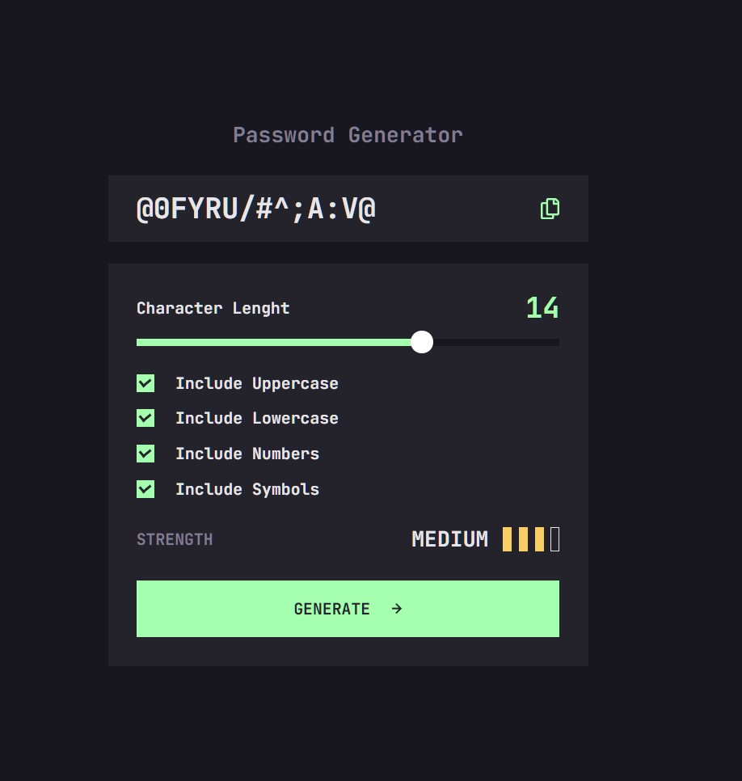

# Frontend Mentor - Chat app

This is a solution to the [Four-card-feature](https://www.frontendmentor.io/challenges/chat-app-css-illustration-O5auMkFqY). Frontend Mentor challenges help you improve your coding skills by building realistic projects.

## Table of contents

-   [Overview](#overview)
    -   [Screenshot](#screenshot)
-   [My process](#my-process)
    -   [Built with](#built-with)
    -   [What I learned](#what-i-learned)
    -   [Continued development](#continued-development)
-   [Author](#author)

## Overview

Deep dive into B.E.M.
Mobile first aproach.

Javascript / jQuery

Break point solving.

### Screenshot

## My process

1. NPM init
2. NPM install all my dev dependencies
   gulp - autoprefixer - webp - css-flatten
   sass
   git
3. git init
4. gihub remote
5. selfhost and set fonts
6. set color pallet to my variables maps
7. calculate font sizes and line-heights to REMs and EMs
8. HTML structure with B.E.M. - resolution switching and art direction for images.
9. DiVe into coding in Sass
10. Javascript/jQuery
11. Mediaqueries
12. testing
13. hosting to github
14. Submit solution to Frontend Mentor

### Built with

-   Semantic HTML5 markup
-   CSS custom properties - BEM naming convention
-   Sass - nesting, variables, mixins, functions, \_partials files.
-   Flexbox
-   Mobile-first workflow
-   Javascript - Jquery

### What I learned

"jQuery"

"position absolute"

"pseudoelements"

Here i am self-hosting fonts compressed it to woff2,
fallback to ttf.

### Continued development

Practise, practise, practise.

### Useful resources

-   [Design Course](https://www.youtube.com/watch?v=er1JEDuPbZQ&t=2s&ab_channel=DesignCourse) - Nice explanation of B.E.M.
-   [MDN](https://developer.mozilla.org/en-US/docs/Learn/HTML/Multimedia_and_embedding/Responsive_images) - Picture element in responsive design.
-   [Kevin Powell](https://www.youtube.com/watch?v=Rik3gHT24AM&t=979s&ab_channel=KevinPowell) - Demonstration img sourceset: how to use it in the code.

## Author

-   Website - [Mirjax Vigokiller](https://github.com/Mirjax2000)
-   Frontend Mentor - [@Mirjax2000](https://www.frontendmentor.io/profile/Mirjax2000)

<!-- ## Acknowledgments

I received big help, lots of motivativation and many new usefull tips and tricks from this user [@stevexero](https://www.frontendmentor.io/profile/stevexero), He doesnt know that but i am watching his challenges and learnig from him. -->
